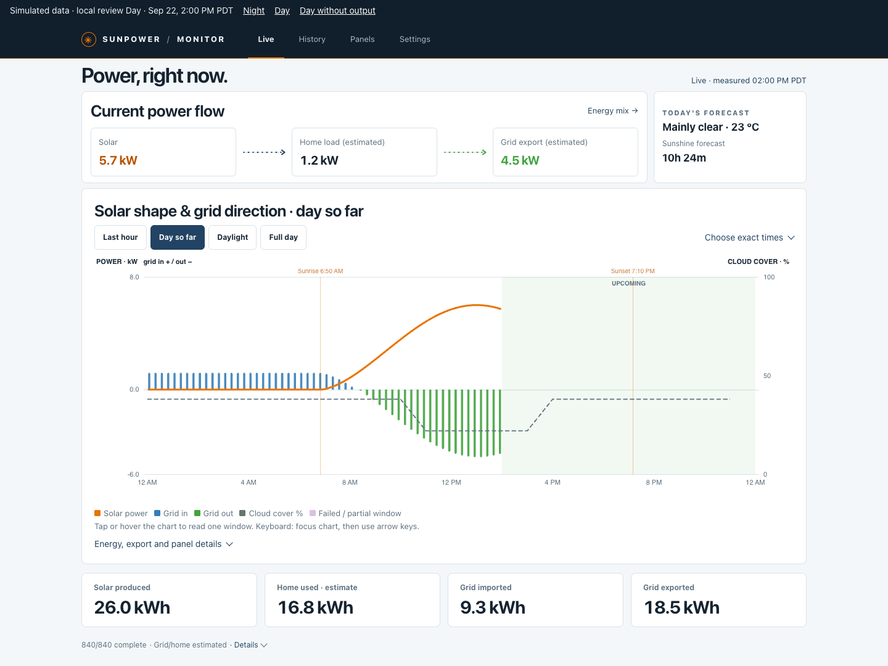
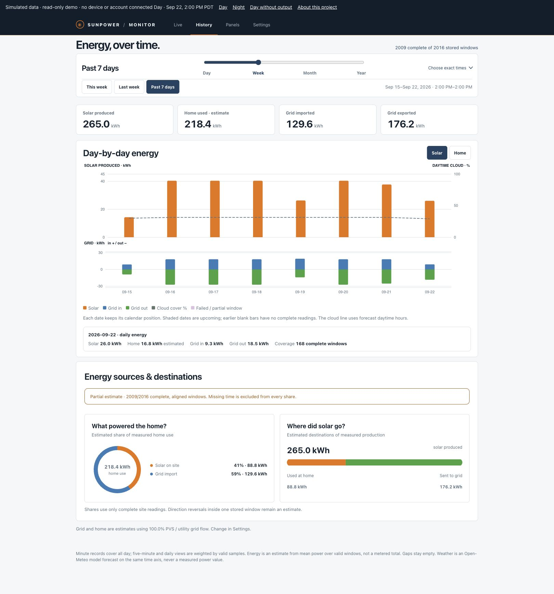
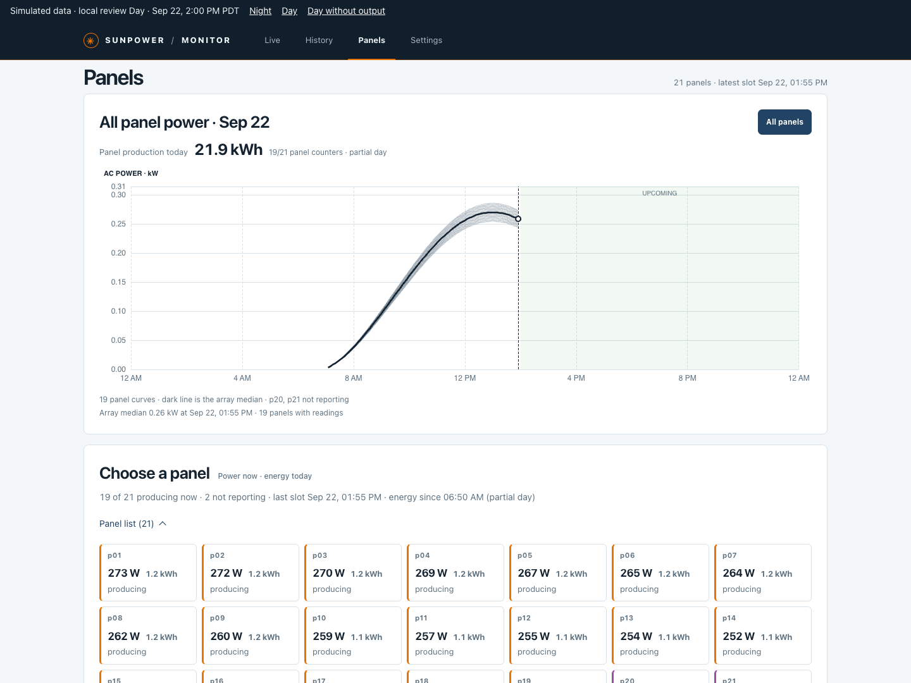

# SunPower Monitor

**A private solar dashboard with live power, energy history, and individual-panel monitoring for SunPower PVS6.**

[](https://github.com/CrabTY/sunpower_monitor/actions/workflows/security.yml)
[](LICENSE)

[Website](https://crabty.github.io/sunpower_monitor/) · [Live demo](https://crabty.github.io/sunpower_monitor/demo/?scenario=day) · [Installation](#installation) · [Dashboard tour](#dashboard-tour) · [Compatibility](#gateway-compatibility) · [FAQ](#frequently-asked-questions) · [Documentation](docs/README.md)

SunPower Monitor helps you see what your solar system is doing now, how its energy use changes over time, and how each panel performs. It reads your PVS6 on the home network, records history, and serves a dashboard you can open on a computer or phone, including when you are away from home.

A small collector runs on your Raspberry Pi, NAS, or Linux host. Your own Cloudflare account stores the readings and hosts the dashboard; GitHub login limits access to the people you allow. Collection is read-only and does not require a SunPower cloud account.



*All screenshots show the actual dashboard with simulated readings, not household data. [View the mobile screenshot](site/assets/mobile.png).*

## Gateway compatibility

The verified configuration is **SunPower PVS6 firmware `2025.10.20.61846`, without a battery**. The installer performs a read-only device check before starting collection. Other PVS6 firmware needs compatibility verification; PVS5, PVS2, other vendors, and battery systems are outside the supported installation path.

The collector must reach the PVS over your LAN. It handles the verified firmware's local authentication; it does not commission the system, provision devices, or change PVS settings. Home and grid readings depend on your installed consumption current transformers (CTs); see the [CT coverage and calibration guide](docs/ct-calibration.md).

## Installation

### What you need

| You need | Purpose |
| --- | --- |
| A PVS6 reachable on the collector's LAN | Supplies the measurements |
| An always-on ARM64 or AMD64 Linux host with Docker | Runs the collector and installer |
| A Cloudflare account with Workers and D1 | Hosts the private dashboard and history |
| A GitHub account and OAuth App | Signs allowed users into the dashboard |

You can use Cloudflare's `workers.dev` address without a custom domain. Home Assistant and a separate database server on the collector host are not required.

### Set up your dashboard

> Source code and the v0.1.0 Release installer are public. The collector image is still private, so automated installation is not available yet. Follow the [manual installation guide](docs/manual-installation.md) to build or run from source.

For a published version, follow the [Quick Start](docs/quick-start.md):

1. Download `install.sh` and `SHA256SUMS` from the same [GitHub Release](https://github.com/CrabTY/sunpower_monitor/releases) onto the collector host.
2. Verify the installer and run it in that host's terminal:

   ```sh
   sha256sum --check --ignore-missing SHA256SUMS && bash install.sh
   ```

3. Follow the browser prompts to authorize Cloudflare, register the GitHub OAuth App, and verify dashboard login.
4. Enter the PVS LAN address and let the installer check the device and start the collector.

The Release installer fixes the source commit and collector image digest; Docker selects the host architecture. Keep the collector-host terminal open while completing browser tasks on your computer or phone. Your personal computer needs only a browser.

For an existing installation, follow [Operations](docs/operations.md) before upgrading so that credentials, queued records, and stored history are preserved.

## Dashboard tour

### Live: power right now

The Live page shows solar production, estimated home load, and grid direction together. Positive grid power means import; negative grid power means export. The chart lets you inspect the last hour, day so far, daylight, or a selected time range.

Readings include freshness information. A stale or missing sample is not presented as a new reading. Optional weather and daylight context come from Open-Meteo and remain separate from measured power.

### History: energy over time



Explore a day, week, month, year, or exact time range. Switch between power in kW and energy in kWh, inspect individual windows, and see the sources and destinations of energy. History starts when your collector begins recording; the dashboard does not retrieve earlier SunPower cloud history.

Site energy totals are estimates from valid power samples. Missing intervals stay visible instead of becoming zero consumption or production. Weather overlays can help compare sunny and cloudy periods.

### Panels: individual output and recorded history



Select a panel or compare the array, inspect recorded five-minute samples, and view daily production for a selected panel. The display distinguishes panels producing now, finished for the day, without production, and not reporting while the rest of the array reports.

| Available diagnostic | Meaning |
| --- | --- |
| AC power | Microinverter output |
| DC power, voltage, and current | Panel-side readings |
| AC voltage and current | Inverter-side readings |
| Heatsink temperature | Reported inverter temperature |
| Recorded energy | Stored cumulative-counter readings and their coverage |

Diagnostics appear when the PVS supplies a valid value. A panel that stops reporting may have a device problem or a failed read; the dashboard cannot determine the cause from missing data alone.

### Settings: location and calibration

Set the site's location and time zone for daylight and local-date views. Display calibration can correct a verified, stable grid-reading ratio after comparison with utility-meter data. It adjusts the displayed grid reading and corresponding home-load estimate, preserves raw records, and leaves solar production unchanged. See the [calibration procedure](docs/ct-calibration.md) before changing the ratio.

## How it works

```text
PVS6 on your LAN → Collector + local SQLite queue → Cloudflare Workers + D1
                                                           ↓
                                                Private browser dashboard
```

Only the collector contacts the PVS. It uploads over outbound HTTPS, so remote viewing does not require opening an inbound route to your home network. Recorded history queues locally during an Internet outage and retries when connectivity returns; live snapshots resume with current readings. The [architecture guide](docs/architecture.md) describes the data flow and authentication boundaries.

## Frequently asked questions

**Can I use it without installing anything first?**
Yes: [open the read-only live demo](https://crabty.github.io/sunpower_monitor/demo/?scenario=day). It uses the same dashboard code with simulated readings, without a PVS, Cloudflare deployment, account, or household data. Developers can also [preview it locally](docs/preview.md).

**Does it run entirely offline?**
PVS collection happens locally, but the hosted dashboard requires Cloudflare and an Internet connection. Historical records queue on the collector during a connection outage. Latest live snapshots are not replayed as history.

**Can I view my system while away from home?**
Yes, through your Cloudflare-hosted dashboard after GitHub login. Access is limited by the configured GitHub user allowlist.

**Why do home consumption or grid readings differ from my utility meter?**
CT coverage, sample timing, and the distinction between instantaneous power and interval energy can affect the comparison. A stable proportional error may be suitable for display calibration; a missing electrical branch cannot generally be recovered with one fixed ratio. Start with the [CT guide](docs/ct-calibration.md).

**Can I use this to identify a failed panel?**
Panel comparisons and history help investigate unusual output, but shading, night, device faults, and failed reads can produce similar symptoms. Check the available measurements and their timestamps before treating a display state as a diagnosis.

**Do I need Home Assistant?**
No. This collector and dashboard work independently. Home Assistant integrations and other community approaches are listed in [References](docs/references.md).

## Documentation

| Looking for | Read |
| --- | --- |
| Setup and first readings | [Quick Start](docs/quick-start.md) |
| Workstation deployment or a direct Python service | [Manual installation](docs/manual-installation.md), [Operations](docs/operations.md) |
| Upgrades, backups, and recovery | [Operations](docs/operations.md) |
| Collector, cloud, and authentication design | [Architecture](docs/architecture.md) |
| CT coverage and display calibration | [CT guide, Chinese](docs/ct-calibration.md) |
| Simulated dashboard for local development | [Preview](docs/preview.md) |

The [documentation index](docs/README.md) also links the bilingual introduction, comparison, and technical references.

## Security

The [security review](docs/security-review.md) records the source review, fixes, automated checks, and their limits. GitHub Actions is configured to run dependency auditing, Semgrep, and Gitleaks on pull requests, main updates, and weekly. The release workflow requires those checks before publishing artifacts. These checks passed for the v0.1.0 release. The badge shows the latest main-branch results; passing checks are not a security certification.

Keep deployment credentials and household telemetry private. Use GitHub private vulnerability reporting when enabled, and avoid posting sensitive details in public issues.

## Contributing

See [CONTRIBUTING.md](CONTRIBUTING.md) for setup, checks, and pull requests. You can work on the dashboard using simulated readings without a PVS or production Cloudflare account.

Community projects informed protocol handling and dashboard presentation, including [SunPower Web Monitor](https://github.com/thomastech/SunPower-Web-Monitor), [sunpower-monitor](https://github.com/karak2112/sunpower-monitor), and [PVS Watch](https://github.com/timkatz/pvswatch). See [References](docs/references.md) for reviewed sources and licenses.

## Support and license

Maintained by [CrabTY](https://github.com/CrabTY). If the project is useful to you, you can [support its development on Ko-fi](https://ko-fi.com/crabty).

Project code and original documentation are [MIT licensed](LICENSE). Third-party components retain their own license notices. Optional weather data is subject to Open-Meteo's service terms.
