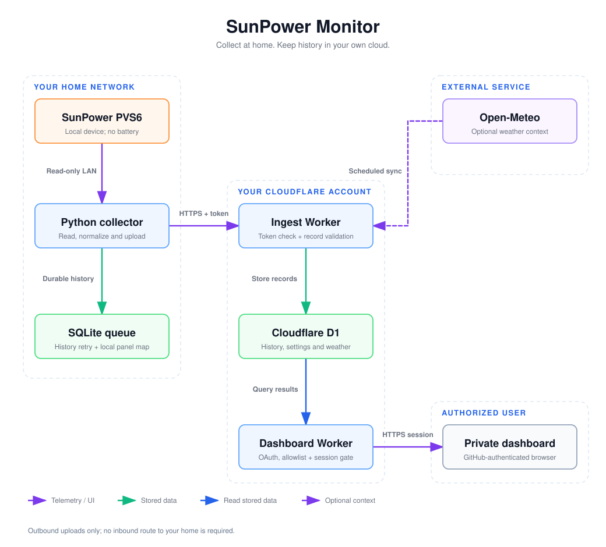

# Architecture

This describes the implemented collector, Workers and browser dashboard. For deployment commands, start with the [Quick Start](quick-start.md); for upgrades and recovery, use [Operations](operations.md).

## Compatibility

The verified device is a SunPower PVS6 running firmware `2025.10.20.61846`, without a battery. Other PVS6 firmware requires a read-only compatibility check before collection. PVS5, PVS2, other vendors and battery-equipped systems are outside the supported installation path.

PVS-reported home load depends on the installed CT coverage. It is not an independent utility-meter measurement. See [CT coverage and display calibration](ct-calibration.md).

## Components and boundaries

Arrows show data delivery and dependencies, rather than connections initiated
by the PVS or database. The collector initiates LAN reads and outbound HTTPS;
the Workers initiate their database and weather requests. GitHub OAuth identifies
the browser user before the dashboard grants a session.

[Editable diagram source](diagrams/architecture.json). Rendered with
[Fireworks Tech Graph](diagrams/README.md); no diagram package runs in the service.

| Component | Implemented role | Source |
| --- | --- | --- |
| Collector | Serialized PVS reads, minute rollups, panel identity, queue and upload retry | [collector/](../collector/) |
| Ingest Worker | Validate uploads, store history/latest values, schedule weather and daily rollups | [workers/ingest/](../workers/ingest/) |
| Dashboard Worker | GitHub OAuth, sessions, allowlist, telemetry APIs, settings and static asset gate | [workers/dashboard/](../workers/dashboard/) |
| Shared cloud code | Upload contract, weather sync and daily aggregation | [workers/shared/](../workers/shared/) |
| Database | Shared D1 schema; v0.1.0 is the public installation baseline | [schema](../workers/schema.sql), [upgrade guidance](operations.md#database-upgrades) |
| Browser dashboard | Live, History, Panels and Settings | [web/](../web/) |

Only the collector talks to the PVS. It initiates outbound uploads; the cloud and browser need no inbound route to the home network. The home host keeps the pending queue and local panel mapping; D1 holds uploaded history. Each installation uses its own cloud resources and credentials.

## Collection and delivery

The default read intervals in [collector/main.py](../collector/main.py) are 10 seconds for site power, 30 seconds for meters, and 300 seconds for inverters and health. These are polling intervals, not guarantees that every firmware produces a new measurement at that rate.

After three consecutive failures, only the failing group waits 60 seconds after
each failed attempt until a read succeeds. Success restores its normal interval.
Failed-read logs and collector event details retain fixed reason/stage labels,
HTTP status, numeric errno and request duration where available; they exclude
arbitrary exception text, response bodies and credentials.

Heartbeats include `health_age_s` and `panels_age_s`, measured from the last
successful group read. Failed or older-than-two-interval health values are null;
the corresponding fresh panel count is zero. A missing age is reported as null.
Panel freshness counts newly queued rows from the latest successful inverter
read; it is not the array's installed panel count.

Restart detection compares uptime progression with monotonic elapsed observation
time, allowing 15 seconds for query latency and rounding. This can detect a
restart across a long outage even when the new uptime exceeds the previous one.
Health observation time and estimated `boot_ts_utc` are logged before
reauthentication; missing or invalid uptime never replaces the valid baseline.
The boot timestamp is an estimate, not a complete history of offline restarts.

Two upload paths have different recovery behavior:

- Latest site snapshots are sent to `PUT /api/v1/live` and replace the cloud latest-value row. They are not durably queued or replayed after an outage.
- One-minute site records, five-minute panel samples and collector events enter the local SQLite queue before `POST /api/v1/records`. Accepted record IDs are acknowledged locally; failed uploads stay queued for retry. Rejected records are isolated for inspection.

The collector assigns anonymous panel IDs and keeps the serial-to-ID mapping locally. New measurement time matters even when power is unchanged. Missing, stale or invalid readings remain distinguishable from a measured zero.

## Data contract and history

[workers/shared/contract.ts](../workers/shared/contract.ts) defines schema version 1, allowed record fields, timestamp/numeric validation and a maximum of 100 records per batch. The cloud accepts these normalized records, not arbitrary PVS dictionaries. Full device responses and credentials are not part of the upload contract.

| Record | Meaning |
| --- | --- |
| `site_minute` | Minute mean power, coverage/quality and available cumulative-counter end values |
| `panel_sample` | Anonymous panel ID, sample slot, source measurement time, available AC/DC diagnostics and energy counter |
| `collector_event` | Collection/upload state changes using limited event codes |

Ingest uses record identity and content validation to make historical retries idempotent; conflicting content is rejected. D1 also stores latest site values, known panels, location, calibration, hourly weather and derived daily site views.

Stored times are UTC. Queries and daily views use the saved site time zone. Site history supports minute, five-minute and daily query resolutions; aggregation does not turn gaps into zero production. Daily views do not replace a database backup or establish an automatic raw-history retention policy. Monitor storage and usage as described in [Operations](operations.md).

## Authentication and private settings

The ingest upload token is separate from dashboard credentials. The dashboard verifies GitHub OAuth, a signed session and the configured numeric GitHub user-ID allowlist. Its Worker runs before static assets so pages, scripts and images share the login gate. Location, calibration and notification mutations also require same-origin requests.

[Optional Bark notifications](notifications.md) are configured from Settings, independently of installation. The dashboard encrypts each deployment's device Key in D1 using a domain-separated key derived from its session secret. A minute cron reads current site data and persists incident, retry and lease state; no page needs to remain open. Collector and ingest do not receive notification credentials. The default is off.

Login/callback routes and the limited `/api/v1/version` service metadata endpoint are exceptions to the session gate; telemetry and settings APIs require a session. Version metadata records the deployment label and source revision, not secret values.

The default installation uses GitHub login and `workers.dev`; the renderer adds a custom-domain route only when configured. Cloudflare Access is not required, and no second login provider is implemented.

## Browser dashboard

The shipped browser uses native HTML/CSS/JavaScript and a bundled ECharts engine. [scripts/checks/page-render-check.mjs](../scripts/checks/page-render-check.mjs) exercises the production clients; [the local preview](preview.md) loads those same clients with simulated API responses.

Live freshness follows the measurement time: up to 30 seconds is live, up to 60 seconds delayed, and older data stale. An unavailable timestamp is unavailable. Weather is a separately sourced context layer and is not substituted for measured power.

Grid power is positive for import and negative for export. Display calibration divides grid power by the saved ratio and adds the grid correction to reported home load. It does not multiply solar or all home load, and does not rewrite stored raw readings. See the [calibration guide](ct-calibration.md) for the comparison procedure.

The public introduction lives in the separate `site/` directory, with overview, getting-started, comparison and project pages. Its screenshots and generated read-only demo use simulated readings; the demo reuses the production browser source and intercepts API calls locally. It does not expose the private dashboard.

## Decisions

- Keep collection at home and history in the owner's cloud account so remote viewing does not require opening the home network.
- Use one Python process and SQLite queue on the collector host; no Home Assistant or historical database service is required there.
- Keep the latest-value path separate from durable history so current readings update before a minute closes, while recorded history survives upload outages.
- Use two Workers with independent upload and browser authentication; neither credential grants the other role.
- Use standard HTTP/JSON between collector and cloud. Reference projects informed protocol and presentation choices; they are not runtime dependencies. See [reference projects](references.md).
- Keep release publication and household deployment separate. A formal Git version tag builds source-checked AMD64/ARM64 images and fixed-reference Release assets. Cloud deployment is a separate manual workflow.

## Installation and upgrade artifacts

The release installer is generated from the root [install.sh](../install.sh) template by [prepare-release.py](../scripts/release/prepare-release.py). It fixes the official source commit and multi-platform image digest. Git tags identify releases; deployment labels identify running installations.

The same [Dockerfile](../deploy/pi/Dockerfile) and collector code serve personal and open-source installations. Queue data, rendered configuration and secrets stay on the host. Compose and direct Python/systemd remain manual alternatives. Follow [Operations](operations.md) before changing an existing deployment; a source-history rewrite alone does not require redeployment.
