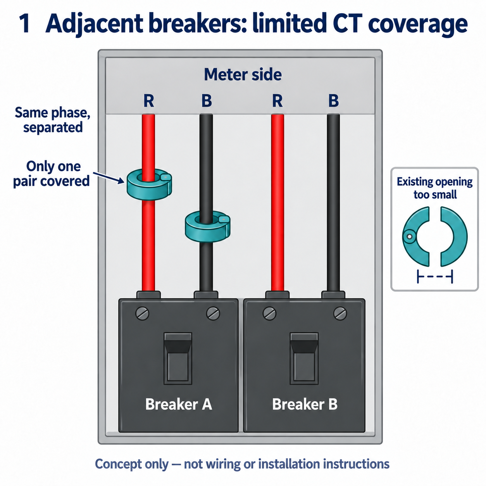
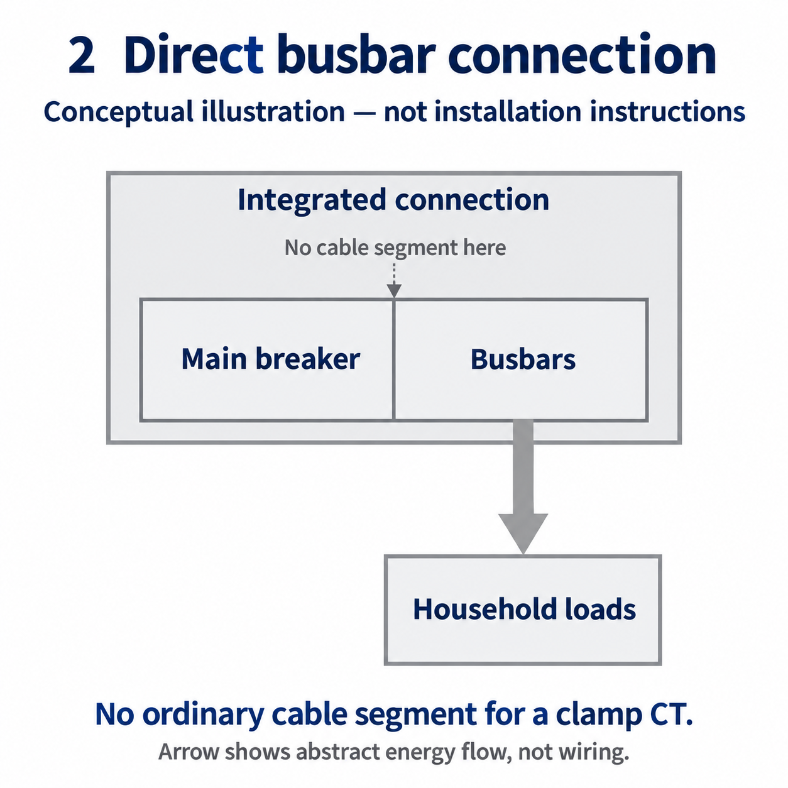
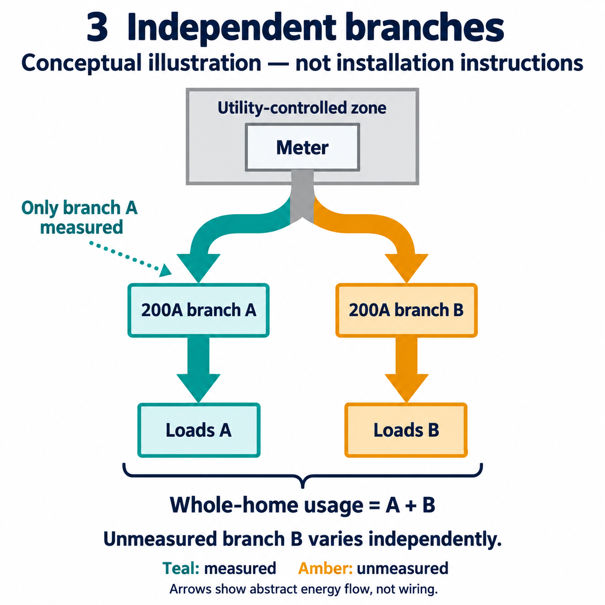

# CT coverage limits and home-use calibration

**The installation may measure only part of the supply path, so the displayed Load may not represent actual whole-home consumption.** This project provides display calibration to correct a stable proportional bias after comparison with utility-meter data.

## SunPower production and consumption metering

SunPower's metering module measures the supply and solar paths, and the PVS exposes those readings. The module uses current transformers (CTs): sensors clamped around conductors during installation.

In the **200A residential service** used as this guide's example, the SunPower metering configuration has four CTs: two for the utility supply path and two for the solar path.

| CTs | What they measure |
| --- | --- |
| Two supply CTs | L1 and L2 on the utility supply path |
| Two solar CTs | L1 and L2 on the solar path |

One pair therefore measures solar and the other pair measures the incoming supply. The [official Sense Solar installation guide](https://help.sense.com/hc/en-us/articles/25275207683603-Installation-Guide-Sense-Solar) uses the same division: one pair for the main supply and one for solar.

## Installation limits in a 200A meter enclosure

The figure below shows the physical arrangement of two adjacent breakers and their supply conductors in one enclosure. Each group has a red and a black conductor, arranged **red, black, red, black**. In this example, the supplied SunPower CT hardware, permitted mounting locations, clamp opening and enclosure space limit measurement coverage. The figure does not indicate whether the downstream loads are connected.

*Figure 1: Adjacent breakers with red, black, red, black conductors; two CTs cover only one pair. The existing clamp opening and available space cannot cover all conductors of each phase. Clamp positions are conceptual, not wiring or installation instructions. See the [Eaton MB2040B200BTSBL product information](https://www.eaton.com/us/en-us/skuPage.MB2040B200BTSBL.html) for a structural reference; this illustration does not reproduce that product.*

In this layout, the customer-side conductors form two separated red/black groups. To cover both groups, the CT measuring red conductors would need to enclose both red conductors, and the CT measuring black conductors would need to enclose both black conductors. The same-phase conductors are separated in the enclosure, and the existing clamp dimensions and positions allow only one red and one black conductor to be measured.

The common location that could measure the complete supply is in the meter area. That area is controlled by the utility and restricts modifications, so the existing CTs cannot be moved there. With this hardware and enclosure layout, **the customer side cannot be fully covered, the meter side is unavailable for installation, and the supply CTs measure only one group of paths.**

The solar CTs can still measure production, but supply measurement is incomplete. Load calculated or reported from those readings may therefore differ from actual whole-home consumption. Another app reading the same PVS data cannot increase CT coverage.

## Supply structures downstream of the meter

In a simple 100A residential service, accessible L1 and L2 conductors downstream of the meter may each supply the entire home. One pair of supply CTs can then cover the complete current.

Homes with existing or planned solar may instead have 200A or 400A services. The relevant question is: **how is current routed and distributed to the home's panels after passing through the meter?** Multiple conductors may join into one outgoing pair, or the supply may use busbars, internal connections or separate feeders. A fixed pair of supply CTs cannot necessarily cover all current at a permitted installation point.

The table below compares these downstream connection structures and shows how the 200A example's coverage problem can occur elsewhere.

| Connection downstream of the meter | Effect on one pair of supply CTs | Product or structural reference |
| --- | --- | --- |
| Conductors join into one L1/L2 pair feeding the home's panel | If this pair is accessible, the CTs can measure the whole supply | A separate 200A panel such as [Eaton CHM42PN200](https://www.eaton.com/us/en-us/skuPage.CHM42PN200.html), supplied by one feeder pair |
| Busbars or internal connections feed the distribution section directly | No ordinary cable segment is available for clamp CTs; the complete measurement point may be on the restricted meter side | Main-breaker/busbar structure in Figure 2 |
| Multiple conductor groups feed the customer side separately | Same-phase conductors are separated; existing CTs may cover only one group | The integrated 200A meter/panel enclosure in Figure 1 |
| Independent supply branches feed different compartments or panels | Measuring one branch misses the other; both branches or a common upstream point must be covered | Class 320 / 400A service with dual 200A main breakers in Figure 3; two separate 200A panels downstream of one meter have the same coverage requirement |

A single 400A main-breaker arrangement also requires consideration of large conductors, multiple same-phase conductors and CT opening dimensions. The [Eaton Class 320 meter-main family](https://www.eaton.com/us/en-us/catalog/low-voltage-power-distribution-controls-systems/b-line-series-meter-breakers.html) includes both single 400A and dual 200A main-breaker configurations, showing that similar service capacities can use different connection structures.

*Figure 2: The main breaker connects directly to busbars, without an ordinary cable segment between them for a clamp CT. Accessible upstream L1/L2 conductors supplying the whole home could provide a measurement point. This illustrates a structural limitation, not actual wiring.*

*Figure 3: Two independent supply branches. Measuring only one misses the other independently varying load. Figure 1 emphasizes conductor arrangement and clamp space; Figure 3 emphasizes branch coverage. The [official Siemens wiring and dimension reference](https://cache.industry.siemens.com/dl/files/224/109800224/att_1074558/v1/SIE_FL_230-71_MeterMain.pdf) lists dual 200A main-breaker models rated for 320A continuous / 400A maximum service. This illustration does not reproduce a product.*

These layouts can leave a fixed CT configuration with the same limitation: **the location carrying all current is unavailable for installation, while an available location carries only part of the current or has no conductor the clamp can enclose.** Installing a consumption-monitoring module does not by itself establish accurate whole-home Load measurement. Compare against the utility meter to identify any bias.

## Metering configuration for 400A services

**The number of CTs SunPower provides for a 400A residential service, and how it combines multiple supply paths, remain unconfirmed.** The four-CT configuration described here comes from the 200A example.

For comparison, the [Sense 400A split-service installation guide](https://help.sense.com/hc/en-us/articles/25272076608659-Installation-Guide-Sense-With-400A-Split-Service) uses the main CTs on one 200A panel and a second Flex CT pair on the other. The second pair uses the same intermediate connection as Sense Solar. Support for 400A service in that configuration therefore does not establish simultaneous support for both supply branches and separate solar measurement.

## What proportional calibration can correct

When installation limits coverage, monitoring must estimate the total from the measured current. The calibration setting provides an adjustable ratio to correct a stable bias verified against utility-meter data, bringing displayed grid flow and estimated home consumption closer to actual values.

[Continental Control Systems](https://ctlsys.com/support/measuring-parallel-conductors/) describes scaling a measurement of some parallel conductors by total conductor count divided by measured conductor count. It also explains that conductor length and connection differences can produce unequal current sharing. Measuring one conductor and scaling by count can therefore remain consistently high or low.

For example, parallel conductors carrying 37A and 43A have a total current of 80A. Measuring only 37A and doubling gives 74A, still 7.5% low. This hypothetical example shows why the actual correction ratio needs comparison with the meter; two conductor groups alone do not justify a fixed multiplier of two.

If the missing measurement is an independent load branch feeding another panel, its use changes as equipment on that branch turns on and off. A fixed ratio cannot reconstruct that data. Proportional calibration applies to a verified, stable bias.

## Compare against the utility meter and set calibration

When installation coverage is limited and readings differ from the utility meter, compare grid energy over matching time ranges to establish whether the proportional bias is stable before applying calibration. Compare utility import/export or net energy with this project's grid data. With solar, net grid energy is not total home consumption.

1. Align utility data and PVS records by time zone, interval boundaries and import/export direction. Integrate recorded power over time into energy for the same interval, in kWh.
2. Use multiple complete intervals with sufficient net energy. Exclude gaps, near-zero intervals and intervals where substantial imports and exports cancel each other. Estimate a stable **PVS grid energy / utility-meter grid energy** ratio.
3. Enter the ratio in **Settings → Grid calibration → PVS / utility grid flow (%)**, click **Save calibration**, and refresh Live / History.
4. Cross-check other dates, load conditions and representative import/export periods. If the ratio changes substantially, investigate measurement coverage further.

For example, enter **50%** when the measured ratio is 50%. The project divides grid readings by 0.5 and adds the same correction to estimated home consumption; it does not double the entire Load, which also includes solar contribution. A value of 100% applies no correction. The accepted range is currently 10%–200%.

Calibration affects the displayed grid flow and home-use estimates in Live / History, including historical and subsequent data. Solar production, individual panel readings and stored raw records remain unchanged. The page does not import utility data automatically.

**Calibration can improve a stable proportional bias, but cannot reconstruct an independently varying unmeasured load.** If both branches cannot be covered, or CT orientation or phase pairing is wrong, investigate the metering configuration first.

## Sources and illustrations

This guide uses one 200A residential service and its SunPower metering module as an example. The three illustrations are original conceptual diagrams generated for this project without product photographs as inputs. They do not show actual equipment dimensions, wiring or installation steps. Product links provide structural references only.

- [Parallel-conductor measurement: Continental Control Systems](https://ctlsys.com/support/measuring-parallel-conductors/)
- [Sense Solar installation guide](https://help.sense.com/hc/en-us/articles/25275207683603-Installation-Guide-Sense-Solar)
- [Sense 400A split-service installation guide](https://help.sense.com/hc/en-us/articles/25272076608659-Installation-Guide-Sense-With-400A-Split-Service)
- Product references appear in the figure captions and layout table. Public sources were reviewed on 2026-09-30.
