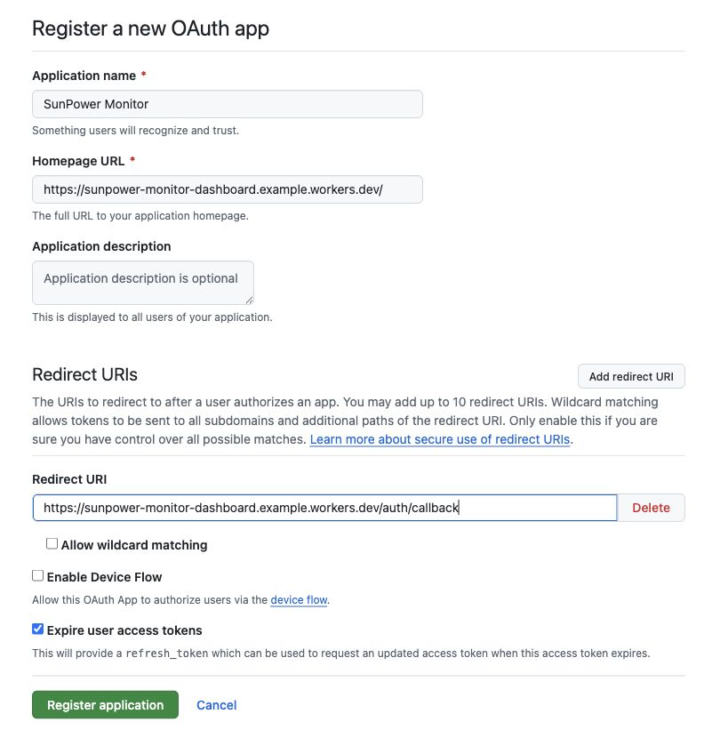
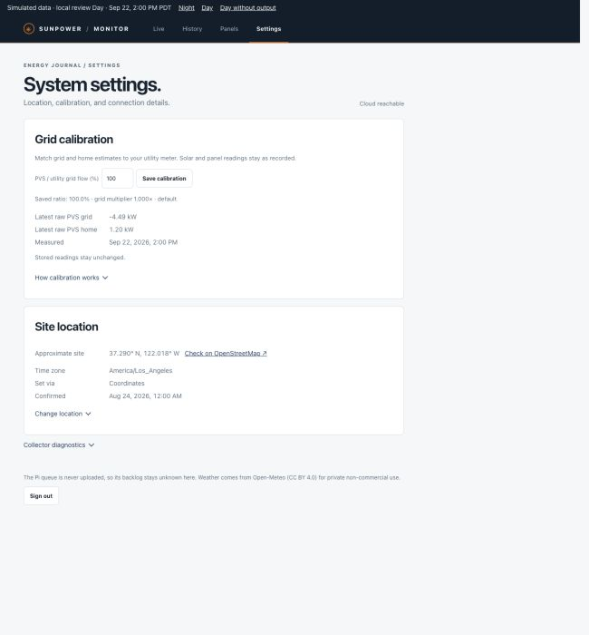

# Quick Start: one terminal on the collector host

SunPower Monitor has three places to think about. Your **browser** is for creating accounts and approving login. An always-on **Pi, NAS, or Linux host** reads the PVS and runs the installer. **Cloudflare** stores readings and serves the private dashboard. Your personal computer does not need the project source, Node.js, Python, or a terminal.

| Place | What you do there | Stays on? |
| --- | --- | --- |
| Personal computer or phone browser | Create Cloudflare and GitHub accounts, approve Cloudflare device login, register a GitHub OAuth App, view the dashboard | No |
| Pi, NAS, or Linux collector host | Run `install.sh` in one terminal; Docker pulls and runs the collector | Yes |
| Cloudflare | D1 stores data; the ingest Worker receives uploads; the dashboard Worker serves the site | Managed for you |

The installer shows six numbered stages, each marked as a browser or terminal task. It pauses at browser tasks and resumes in the **same collector-host terminal**. It runs Node.js and Wrangler in a temporary Docker container during setup; the long-running collector image contains only Python. The collector uses a local SQLite queue when the Internet is unavailable.

Cloudflare's Wrangler login lives in a temporary private directory while the script runs. Executable Node dependencies use a temporary Docker volume so NAS directories mounted with `noexec` work too. The installer removes both on exit; they are not stored in Git or in the collector image.

> **Release status:** The v0.1.0 installer is public, but its collector image remains private, so automated installation is not available to anonymous users yet. Use [manual installation](manual-installation.md) to build or run from source. When the image is public, use the installer attached to the release; the source-tree installer has no production image pin.

## Before you start

- A SunPower PVS6 reachable by LAN address from the collector host.
- Docker running on an AMD64 or ARM64 Pi, NAS, or Linux host, plus `curl` and `tar`. The installer checks Docker; it does not install Docker or change NAS system settings.
- A [Cloudflare account](https://developers.cloudflare.com/fundamentals/account/create-account/) with Workers enabled and a GitHub account. Cloudflare's `workers.dev` address lets you start without owning a domain. The [Workers](https://developers.cloudflare.com/workers/platform/pricing/) and [D1](https://developers.cloudflare.com/d1/platform/pricing/) Free allowances are available; check their current limits for your expected use. Cloudflare Access is not part of this GitHub-login path.
- A way to open browser links shown in the collector-host terminal. If you connect to the Pi by SSH, keep that terminal open while using the browser on your computer or phone.

## 1. Start the installer on the collector host

For a published release, download **one script** directly on the Pi/NAS and run it in an interactive terminal:

```sh
curl -fL --output install.sh https://github.com/CrabTY/sunpower_monitor/releases/download/v0.1.0/install.sh
bash install.sh
```

Use the same release's `SHA256SUMS` to verify the download. The script downloads the exact source commit from `CrabTY/sunpower_monitor` into a temporary directory for the two Workers and pulls the collector by its multi-platform image digest. Both pins are recorded in the attached `release.json`; Docker selects AMD64 or ARM64. It does not build an image on your host.

## 2. Approve Cloudflare access in your browser

The terminal starts a temporary Node/Wrangler container. Wrangler prints a link and device code **in the Pi/NAS terminal**. Open the link in your personal computer or phone browser, enter the code, and approve access. The authorization page never needs to open on the Pi/NAS. Return to the terminal after approval.

If you have one Cloudflare account, the installer selects it automatically and shows its name. If you have multiple accounts, choose the intended account from the list.

## 3. Configure and deploy in the collector-host terminal

The installer asks for an **installation name**. That name becomes the D1 database name and the first part of two Worker names, such as `home-solar-dashboard` and `home-solar-ingest`. There is no random suffix; different Cloudflare accounts already have distinct `workers.dev` account subdomains. Choose a name not already used in your account. If a D1 database with that name exists, the installer asks before reusing it; it also asks before deploying Workers that could already exist.

You may enter an optional dashboard hostname that is already in a Cloudflare zone you control. Leave it blank to use the free `workers.dev` address. Enter your GitHub username, profile URL, or email. GitHub [user search](https://docs.github.com/en/search-github/searching-on-github/searching-users) exposes only public profile emails: the installer accepts an email only when it identifies one user and the profile email matches exactly. If your email is private or cannot identify one account, it asks for your username or profile URL without restarting authorization. The installer uses the resolved numeric user ID, creates D1, applies the schema, and deploys both Workers. It automatically reads their addresses from Wrangler's deployment results and checks each Worker through its version endpoint; you do not need to copy addresses back into the terminal. The dashboard URL is known **before** registering the OAuth App.

## 4. Register GitHub login in your browser

Keep the collector-host terminal open at stage **4/6**. An OAuth App connects your dashboard to GitHub login; create it in your personal browser:

1. Open [Register a new OAuth App](https://github.com/settings/applications/new) and sign into the GitHub account selected earlier. You can also reach it through **Settings → Developer settings → OAuth Apps → New OAuth App**.
2. Copy the three values shown separately in the terminal into the form:

| GitHub field | What to enter |
| --- | --- |
| Application name | The suggested `SunPower Monitor (your installation name)` |
| Homepage URL | The dashboard URL printed by the installer |
| Redirect URI / Authorization callback URL | The exact printed callback URL, ending in `/auth/callback` |

Leave the description empty. Keep **Allow wildcard matching** and **Enable Device Flow** unchecked.



The screenshot uses example addresses; copy the values from **your** collector-host terminal. GitHub's [OAuth App instructions](https://docs.github.com/en/apps/oauth-apps/building-oauth-apps/creating-an-oauth-app) describe the registration form.

3. Click **Register application**. On the resulting app settings page, click **Generate a new client secret**. Keep that browser page open.
4. Return to the collector-host terminal and press Enter. When it asks for **GitHub Client ID**, copy the Client ID from the app settings page, paste it in the terminal, and press Enter.
5. When it asks for **GitHub Client Secret**, copy the newly generated secret, paste it in the terminal, and press Enter. The secret will not appear while you type or paste; this is expected. Do not send it in chat or include it in screenshots.

The installer then generates a session signing secret and a separate upload token, sets the appropriate Worker secrets, and keeps the upload token in a private file on the collector host. No secret belongs in Git or in the Docker image.

## 5. Check GitHub login in your browser

Before the collector starts, the installer checks that anonymous requests cannot read dashboard data or upload to the ingest Worker. Open the dashboard address shown at stage **5/6** in your personal browser and sign in with the allowed GitHub account. An empty dashboard is expected before collection starts. Once login succeeds, return to the collector-host terminal and press Enter.

If login reports `oauth_failed`, keep the terminal open and read the diagnostic code. `github_token_incorrect_client_credentials` means the Client ID and Client Secret are invalid; type **R** at the terminal's login-check prompt and copy both from the same OAuth App. This updates only those two credentials and returns to the browser login check, without repeating Cloudflare authorization or deploying the database and Workers again. Empty values or copied labels with spaces prompt again. Type **Q** to stop, or press Enter only after a successful login. `github_token_redirect_uri_mismatch` means its Redirect URI must match the dashboard URL plus `/auth/callback`. `github_token_bad_verification_code` means start a new login from the dashboard homepage rather than refreshing the callback URL. `github_token_unverified_user_email` means verify your primary email in GitHub. See [GitHub's token request troubleshooting](https://docs.github.com/en/apps/oauth-apps/maintaining-oauth-apps/troubleshooting-oauth-app-access-token-request-errors). Do not share callback URLs containing a login code or any secret when reporting errors.

## 6. Pull and start the collector on the same host

Back in the Pi/NAS terminal, enter only the PVS LAN address. The installer uses the image pinned in the reviewed release; Docker automatically selects its AMD64 or ARM64 variant. It runs a read-only PVS check and starts one Docker container with a persistent local queue and automatic restart. It refuses to start if an existing SunPower Monitor collector is detected. Users do not need to select a registry, image tag, or architecture.

A release is ready for anonymous installation only after its source download and image pulls have been checked without GitHub or registry credentials on both architectures. Maintainers testing a preloaded local image can set `SUNPOWER_COLLECTOR_IMAGE` and `SUNPOWER_USE_LOCAL_IMAGE=1`; these are test settings, not user prompts. The collector does not require Node.js, Wrangler, a Cloudflare login, or GitHub credentials at runtime; it needs only the PVS address, ingest address, and upload token.

## After installation: verify readings in your browser

After the first upload, open the dashboard URL and sign in through GitHub. The Live page should show the latest readings. If it stays empty, inspect the container with `docker ps` and `docker logs sunpower-monitor-collector`, then use the [operations guide](operations.md).


This screenshot uses simulated readings. Missing or stale measurements appear as missing, not zero. The optional Settings page can add location for weather after the first upload; weather is separate from PVS measurements.



For architecture and data contracts, see [Architecture](architecture.md). For source development or a pull request, see [Contributing](../CONTRIBUTING.md). Direct Python service setup and backups remain in [Operations](operations.md).
